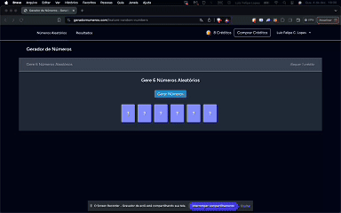

<h2 align="center"> Gerador de Números </h2>

<h4 align="center"> SaaS System with a Random Number Generator Feature Using Laravel + React JS. </h4>

<p align="center">
<br>
    
    
    
    
</p>

## Description
Gerador de Números is a project SAAS that provide a unique random number generator. This solution not only automates the process but also allows users to manage credits intuitively, with customizable recharges of 10, 40, or 100 credits.

## Preview


## Links
Gerador de Números is available in: https://geradornumeros.com/

## Instructions

- Install JS dependencies: ```npm install```;
- Install PHP dependencies: ```php composer install```;
- Init Laravel server: ```php artisan serve```
- Run server: ```npm run dev```
- Click in the server available
- Enjoy!

## Find me on 
 <a href="mailto:lfelipelopesti@gmail.com" target="_blank"></a>

<a href="https://luizfelipelopes.github.io" target="_blank"></a>

<a href="https://www.linkedin.com/in/luizfelipelopes/" target="_blank"></a>
